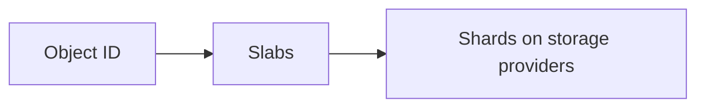

# Indexers

An **indexer** is a service that sits between applications and storage providers. It tracks where objects live on the Sia network, keeps their data healthy, and enforces a simple access model so apps don’t need to manage hosts, contracts, or repairs themselves.

Applications talk to the indexer for object IDs, metadata, layout, and access control, and they talk to storage providers to upload and download the encrypted data that makes up those objects.

## What does an indexer do?

An indexer is responsible for:

- storing **sealed objects** keyed by object ID  
- tracking which **slabs** (and their shards on storage providers) belong to each object  
- monitoring storage providers and **repairing slabs** when redundancy drops  
- managing **accounts and app keys** so multiple apps can safely share the same indexer  
- exposing an API/SDK so applications can save, list, and fetch objects without dealing with hosts or contracts directly  

You can think of it as the “object directory and health manager” for a set of applications using the Sia network.

## The role of indexers

### Metadata

Indexers know just enough about each object to track and maintain it. For every object, an indexer knows the following:

- the **object ID** (a content-derived hash of the object’s slabs)
- the set of **slabs** that store the object’s data
- the **creation timestamp**
- the **size** of the opaque metadata blob

The metadata itself is:

- **application-defined** — the app chooses the structure and fields  
- **encrypted** — the indexer never sees it in plaintext  
- **opaque** — the indexer cannot derive any meaning from it  

Indexers do **not** know filenames, paths, tags, content types, versions, or any other semantic information about objects. If you want to search or filter by those things, you build that logic in your application or in a separate index.

### Access controls

Indexers enforce access at the **account + app key** level.

- Each **account** represents a logical owner (user, team, or service).  
- Each **app** derives an **app key** and registers it with the indexer.  
- When an app stores an object, the indexer associates that object ID with the account and app key that signed it.

When an application calls the indexer:

- it authenticates using its app key for a specific account  
- the indexer will only list, return, or delete **objects that belong to that (account, app key)** pair  
- the indexer never inspects metadata to decide who “should” see an object  

Indexers can also support **share URLs** that allow anyone with the link to read a specific object. Fine-grained permissions (per-user ACLs, groups, roles, and so on) are intentionally out of scope and implemented entirely at the app layer.

### Data health and repair

Indexers are responsible for keeping stored data healthy over time.

For each object ID, the indexer maintains a mapping:

Using this basic mapping, an indexer:
- periodically scans storage providers to measure availability
- tracks how many shards for each slab remain healthy
- repairs slabs by re-encoding data and uploading new shards when redundancy falls below a target threshold
- deletes slabs when applications unpin or remove objects

If an indexer server crashes or is offline, the metadata and mappings are not lost—they remain in its database—but health checks and repairs do not run. If it stays down for a long time, it may be necessary to migrate to a new server so repair jobs can resume before redundancy decays too far.

## Privacy boundary

Objects are sealed by the SDK before they reach the indexer. The SDK encrypts the data and metadata and sends only:

- the **object ID**,
- the **slab layout** (which slabs and hosts hold the encrypted shards),
- the **encrypted metadata** blob, and
- timestamps.

Indexers never see plaintext data or metadata.

Storage providers store encrypted **shards** only; they do not see object IDs, metadata, or any application-level information about the data they hold. The keys needed to decrypt data and metadata stay with the application (or user), not with the indexer or storage providers.

Indexers **can** observe operational information, such as:

- approximate object sizes (derived from the slab layout)
- which account and app key own which object IDs
- when objects are created and when layout/metadata is requested

Indexers **cannot** see:

- the plaintext contents of objects
- the structure or fields of metadata
- application-level concepts like filenames, folders, tags, or document semantics

This boundary lets indexers manage data placement and health without learning
what the data actually is.

## What indexers don’t do

Indexers deliberately avoid higher-level object-store features. They do **not**:

- provide paths, prefixes, or buckets
- implement directories or folder hierarchies
- search or filter over metadata
- introspect or validate metadata or schemas
- implement per-user ACLs, groups, or role-based permissions
- handle application logic such as version history, trash, or billing

Their job is to track objects on the Sia network and keep the underlying data healthy. Everything else belongs at the application layer. App that need richer behavior build it on top of the indexer’s simple, object-centric interface.

## Why indexers are central to Sia’s user-friendly architecture

Without an indexer, every application would need to:

- discover and score storage providers
- form and maintain contracts and payment accounts
- decide where to place slabs and how to repair them
- track which slabs belong to which objects
- bolt on its own access-control system

Indexers centralize that complexity into a reusable service:

- **For users:** they can allow multiple apps to work with objects in the same account while keeping each app’s objects isolated by app key and preserving data privacy.
- **For developers:** they provide a small, stable API focused on objects and metadata, instead of forcing each app to manage hosts and contracts.
- **For operators:** they cleanly separate “run indexers and storage providers” from “build applications,” so infrastructure and apps can evolve independently.

By staying narrow—tracking objects, preserving privacy, managing data health, and enforcing a simple access model—indexers make Sia’s decentralized storage layer feel like a straightforward, user-friendly object service.
