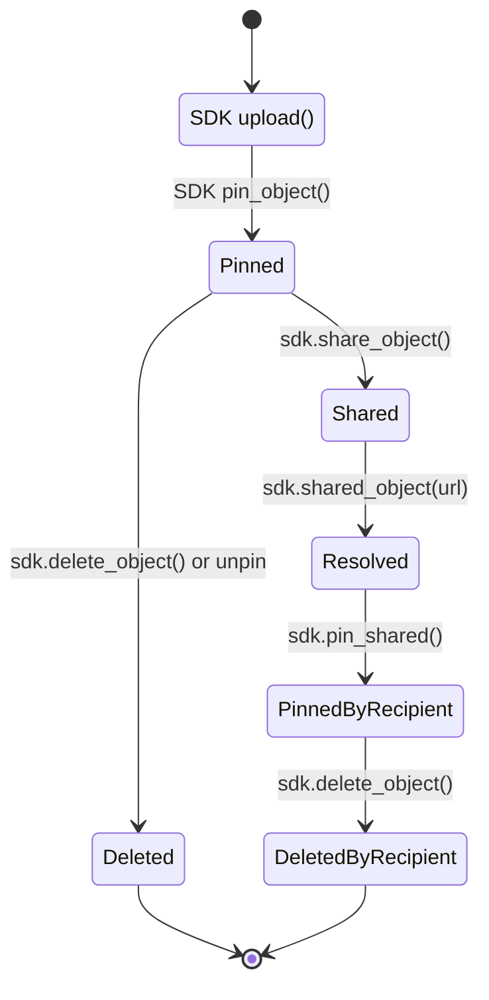

# Pinning

Pinning is a foundational concept in Sia’s storage model.
It determines which objects your application wants the indexer to track, synchronize, and maintain over time. Understanding pinning is essential for building apps that upload, share, sync, or list data reliably.

## What “Pinning” Means

When an object is *pinned*, it is registered with the indexer and becomes part of the indexer’s tracked state for your application.

Pinning means:

* The object’s encrypted metadata is recorded by the indexer.
* The indexer records how that object maps to encrypted slabs stored on hosts.
* The object becomes part of the app’s tracked object set.

As a result, a pinned object:

* Appears in object listings and sync queries
* Generates events when it changes
* Can be downloaded, shared, or deleted by authorized apps using the same App Key

Pinning does **not** store or cache data locally.
It simply tells the indexer, “this object matters to my app,” so the indexer can help manage it over time.

## Pinning vs. Storage

It’s important to distinguish:

### Pinning

* Occurs at the **indexer layer**
* Registers an object with the indexer
* Makes the object part of the app’s tracked state
* Enables discovery, synchronization, and deletion

### Storage

* Occurs at the **host layer**
* Stores encrypted slabs
* Maintained by Sia storage providers
* Managed by contract renewals and upload redundancy settings

Your indexer ***does not*** store raw file data.
Hosts do.

Your indexer ***does*** store encrypted object metadata and slab mapping so your app can find those slabs again later.

## How Objects Become Pinned

Objects can become pinned in several ways:

### During Upload

After uploading, the app calls `pin_object()` to persist the object record in the indexer. Upload and pin are separate steps — pinning is not automatic.

### Pinning a Shared Object

If your app receives a shared object, pinning it registers the object with your indexer so it becomes part of your app’s tracked state.

### Importing a Sealed Object (advanced)

Sealed objects are self-contained, encrypted bundles that can be transferred across devices or indexers.
Opening a sealed object results in a pinned object.

## When You Should *Not* Pin Objects

Avoid pinning:

* Temporary files your app does not need to persist
* Objects used only for one-time downloads
* Objects the user does not want stored in the indexer’s history

Pinning does not consume storage on hosts, but it does add entries to the indexer’s metadata database, increasing the amount of metadata the user is responsible for storing and may be billed for.

**Apps should only pin what they intend to store long term.**

## Unpinning and Deleting

When you delete a pinned object:

* The indexer marks it as deleted
* It no longer appears in object listings
* It stops generating events
* The underlying shards on hosts may remain until contract expiry

The SDK currently treats “delete” and “unpin” as the same operation—removing the object from your app’s indexer state.

## Pinning and Syncing

Pinning is the foundation of Sia’s object sync model.

Every pinned object contributes to an event stream:



These events are returned via:

```plaintext
sdk.objects(AppObjectsQuery { cursor, ... })
```

This allows your app to synchronize its local state with the indexer efficiently and incrementally.

Without pinning, an object produces no events, cannot be listed, and cannot be synced.
