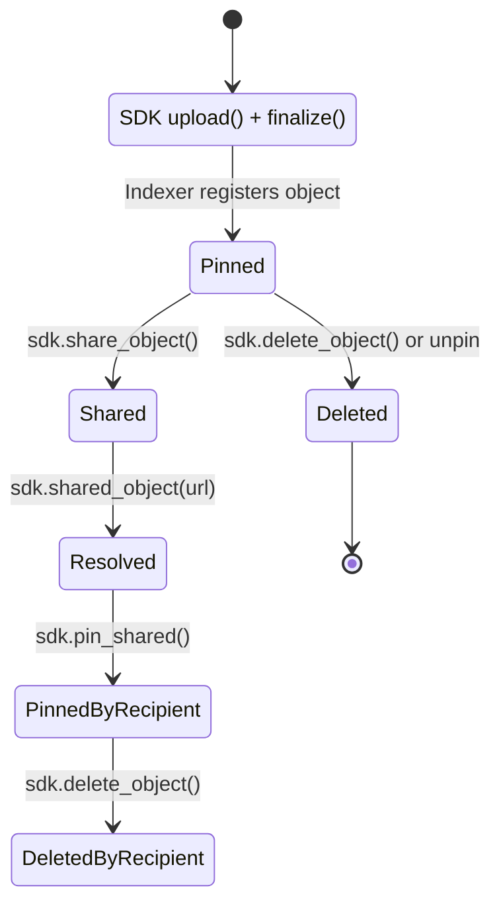

# Pinning

Pinning is a foundational concept in Sia’s storage model.
It determines which objects your application wants the indexer to track, synchronize, and maintain over time. Understanding pinning is essential for building apps that upload, share, sync, or list data reliably.

---

## What “Pinning” Means

When you upload a file through the SDK, the result is a `PinnedObject`.
This means:

* The object’s encrypted metadata is stored in the indexer
* The indexer maintains a reference to its slabs (the erasure-coded data stored on hosts)
* The object will appear in:

    * `sdk.objects(...)` listings
    * object sync streams
    * indexer UI (if you have one)

A pinned object is tracked, meaning your application (or any authorized app using the same App Key) can:

* List it
* Download it
* Delete it
* Share it
* Receive events when it changes

Pinning does not mean storing or caching data locally.
It means registering the object with the indexer so the indexer can help your app manage it over time.

---

## Pinning vs. Storage

It’s important to distinguish:

### **Pinning**

* Occurs at the **indexer layer**
* Tracks object metadata and references
* Determines which objects your app knows about
* Enables listing, syncing, events, sharing, and deletion

### **Storage**

* Occurs at the **host layer**
* Stores encrypted slabs
* Maintained by Sia storage providers
* Managed by contract renewals and upload redundancy settings

Your indexer ***does not*** store raw file data.
Hosts do.

Your indexer ***does*** store object metadata and slab mapping so your app can find those slabs again later.

---

## How Objects Become Pinned

### **1. Upload**

Calling:

```plaintext
upload = sdk.upload(...)
pinned = await upload.finalize()
```

automatically returns a `PinnedObject`, and the indexer records it.

### **2. Pinning a Shared Object**

If someone shares a signed URL with you:

```plaintext
shared = await sdk.shared_object(url)
pinned = await sdk.pin_shared(shared)
```

This creates a pinned copy of the shared object under your app’s account.

### **3. Importing a Sealed Object (advanced)**

Sealed objects are fully encrypted bundles that can be exported/imported across indexers or devices.
Opening a sealed object results in a pinned object:

```plaintext
pinned = PinnedObject.open(app_key, sealed_object)
```

---

## When You Should Pin Objects

Pin objects when:

* You upload them
* You want to keep track of them across sessions/devices
* You want them to appear in `sdk.objects()`
* You want to receive update/delete events
* You want to treat them as part of your application’s permanent state

You may also pin objects that were:

* Shared with you
* Imported from backup
* Recovered via sealed objects

---

## When You Should *Not* Pin Objects

Avoid pinning:

* Temporary files your app does not need to persist
* Objects used only for one-time downloads
* Objects the user does not want stored in the indexer’s history

Pinning costs nothing in storage terms—but it creates entries in the indexer’s metadata layer.
Apps should only pin what they intend to track.

---

## Unpinning and Deleting

When you delete a pinned object:

* The indexer marks it as deleted
* It disappears from `sdk.objects()` listings
* It stops generating events
* The underlying slabs on hosts may remain until contract expiry

The SDK currently treats “delete” and “unpin” as the same operation—removing the object from your app’s indexer state.

---

## Pinning and Syncing

Pinning is the foundation of Sia’s object sync model.

Every pinned object contributes to an event stream:



These events are returned via:

```plaintext
sdk.objects(AppObjectsQuery { cursor, ... })
```

This allows your app to synchronize its local state with the indexer efficiently and incrementally.

Without pinning, an object produces no events, cannot be listed, and cannot be synced.

---

## **Best Practices**

**Keep App ID Stable**

:   A stable App ID ensures you always derive the same App Key, which ensures access to previously pinned objects.

**Attach Metadata Thoughtfully**

:   Metadata is encrypted, so feel free to include filenames, MIME types, or user-facing labels.

**Pin Shared Objects You Want to Persist**

:   If someone sends you a share URL, pin it to ensure it appears in listings and survives app restarts.

**Avoid Over-pinning Ephemera**

:   If your app handles lots of temporary files (e.g., transcoding), pin only what you want indexed.