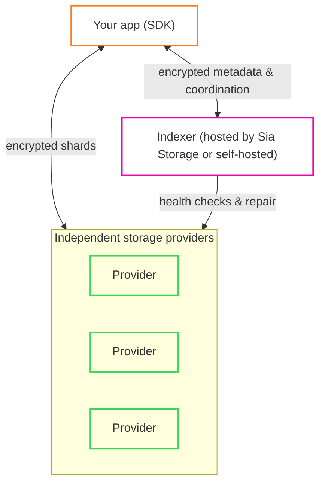

# Trust & Deployment Model

Sia's architecture splits responsibilities across three parties. This page explains what each one can see and do, and answers the questions you should ask before building on any storage service:

Your app encrypts and erasure-codes data locally, then sends encrypted shards directly to [storage providers](./storage-providers.md). The [indexer](./indexers.md) coordinates: it tracks which shards belong to which object, monitors their health, and repairs them when providers disappear. Keys never leave the user's device.

## Deployment options

The SDK works with any Sia indexer:

* **Hosted** — [sia.storage](https://sia.storage) is a hosted indexer operated by Sia Storage. It requires no setup and includes a 50GB free tier.
* **Third-party** — any indexer operated by someone else works the same way; you only change the indexer URL.
* **Self-hosted** — you can run your own indexer and keep the coordination layer under your control.

Because objects are sealed client-side, the trust model is the same in all three cases: the indexer operator never sees your users' data.

## What can the indexer see?

The indexer sees only what it needs to track and maintain objects: object IDs, slab layouts, encrypted metadata blobs, and timestamps. From that it can observe approximate object sizes, which registered app key owns which objects, and when objects are created or accessed.

It **cannot** see plaintext data, the structure or fields of your metadata, or application-level concepts like filenames, folders, and tags. Storage providers see even less: encrypted shards only, with no object IDs or metadata at all. See [Indexers § Privacy boundary](./indexers.md#privacy-boundary) for details.

## What can the indexer modify?

Objects are sealed before they reach the indexer: the SDK encrypts the data and metadata and signs the sealed record with the app's key, and the object ID is derived from the object's content layout. Downloads verify shard integrity and decrypt locally, so the indexer cannot forge or silently alter an object's contents.

What the indexer *does* control is its own tracked state: it can stop tracking objects or refuse service. Your users' data stays private either way; the sections below cover how to plan for the availability risk.

## Who pays for storage?

Storage providers earn Siacoin by contract with a *renter* — in this architecture, the indexer. The indexer operator forms and maintains contracts with storage providers and pays for the capacity apps consume; hosted indexers such as sia.storage offer this as a service with a free tier to start. Pinned objects also add records to the indexer's metadata database, which the account may be billed for above free-tier limits.

## Who repairs data?

The indexer periodically scans storage providers, tracks how many shards of each slab remain healthy, and re-encodes and re-uploads shards when redundancy drops below a target threshold. Your app does not participate in repair.

## What happens if the indexer goes offline?

Data does not disappear. Encrypted shards remain on storage providers, and existing redundancy — by default any 10 of 30 shards reconstruct a slab — stays intact. While the indexer is down, health checks and repairs pause, and apps cannot look up or pin objects through it. If downtime is prolonged, the indexer's database can be migrated to a new server so repairs resume before redundancy erodes.

Most apps should keep a local copy of their object metadata. With a local copy, an app can migrate its objects to a new indexer even while the original indexer is offline.

## Can users move between indexers?

Objects can be exported as *sealed objects* — self-contained, encrypted bundles that can be transferred across devices or indexers and pinned on the destination. See [Pinning](./pinning.md) for how sealed objects re-enter tracked state.

## Does my app need backend infrastructure?

No. The SDK runs inside your app — browser, mobile, desktop, or server — and talks directly to the indexer and to storage providers. There is no per-app backend required to store, retrieve, or share data. If your app needs features the indexer deliberately doesn't provide (search over metadata, per-user ACLs, version history), you build those at the application layer.

## Is Sia Storage required in production?

No. The SDK connects to any indexer, and you can run your own in production. Objects are sealed client-side regardless, so your users' privacy does not depend on which indexer you choose.

## What is the recovery model?

The user's BIP-39 recovery phrase is their master secret. Each app derives its App Key from the phrase plus the app's App ID, so a user who loses a device can re-derive the same App Key on a new one from the phrase alone. Your app never stores or transmits the phrase — it stores only the derived App Key. See [Apps](./apps.md) for the full identity model.
